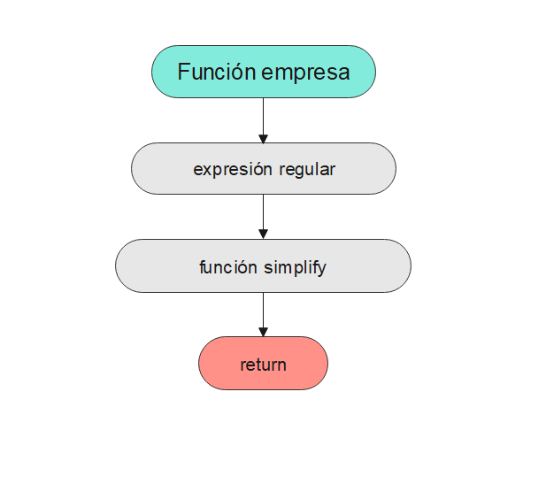
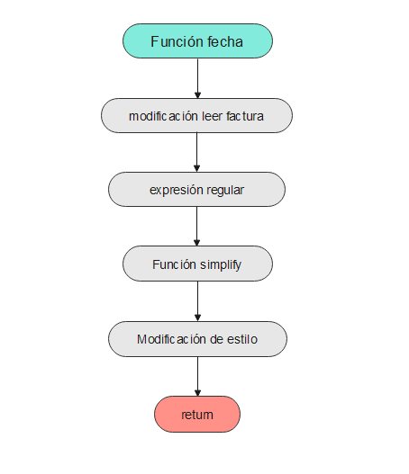

```{r setup,eval=FALSE, include=FALSE}
library(reticulate)  
knitr::opts_chunk$set(echo = TRUE)
#use_condaenv("Python 3_8")

```

# 0. Introducción

<center>

</center>

El "text mining", también llamado Minería de Textos, es el análisis de datos no estructurados contenidos en un texto en un lenguaje nautral utilizando varios métodos, herramientas y técnicas.Cabe destacar que la exploración de los textos se hace de manera automática o semiautomática, buscando patrones repetitivos, tendencias, etc, que explican el comportamiento del text. Es un proceso que todo Data Scientist debe conocer por todas sus amplias aplicaciones, como por ejemplo el mundo empresarial o el mundo de investigación médica.

En este trabajo se tratará de identificar y clasificar los distintos elementos de facturas, exportar un archivo en excel con toda la información y realizar diferentes gráficas que muestren un resumen de las facturas.

# 1. Materiales y métodos

Instalamos las librerias que vamos a utilizar a lo largo del trabajo y las importamos.

```{r install, echo=TRUE,eval=FALSE, message=FALSE, warning=FALSE}

#py_install("pandas")
#py_install("numpy")
#py_install("scipy")
#py_install("seaborn")
#py_install("regex")
#py_install("io")
#py_install("datetime")
#py_install("matplotlib")
#py_install("locale")
#py_install("os")
#py_install("json")
#py_install("tkinter")
#py_install("tkinter")

```

```{python librerias, eval=FALSE, message=FALSE, warning=FALSE, include=TRUE}
#Instalamos las librerias

import pandas as pd
import numpy as np
from scipy import stats
import seaborn as sns
import matplotlib.pyplot as plt
sns.set(style="whitegrid")
import regex as re
import io
from datetime import datetime
import tkinter as tk
from tkinter import filedialog
import json
import os

```

## 1.1. Cargar Datos

Se nos proporcionaba un archivo llamado `dict_wB.json` donde se encontraban todas las facturas comprimidas. Mediante la libreria `json` abríamos ese archivo como un diccionario, donde las "keys" son los titulos de cada factura y los "values"  son el contenido de cada factura. Decidimos exportar la información de cada factura dividiendola en 21 archivos txt para el mejor manejo de cada una de ellas.
El código para exportar dichos txt fue el siguiente:

```{python cargadatos, eval=FALSE, message=FALSE, warning=FALSE, include=TRUE}

#EXPORTAR DICCIONARIO EN ARCHIVOS TXT

with open("./dict_wB.json", 'r') as fp:                         #Abrimos el archivo .json y lo guardamos en un diccionario
    data = json. load(fp)

filepath = "./facturas/"                                        #Creamos el directorio ./facturas/
try:
    os.mkdir(filepath)                                          #creamos la carpeta facturas, donde irán nuestros txt
except OSError:                                                 #Si la carpeta ya está creada nos avisa el programa
    print("Carpeta ya creada de antes")
else:
    print("Carpeta creada desde cero")

for nombre, valor in data.items():                              #Creamos cada txt en función de su nombre y su contenido     
    with open(filepath+nombre+".txt", "w") as facturaarchivo:   #Creamos un txt vacío con su nombre
        facturaarchivo.write("%s %s\n" %(nombre, valor))        #Escribimos en él, el contenido

```

Una vez hecho esto ya comenzamos la búsqueda de patrones de cada txt, el `"text mining"`.

# 2. Text mining {.tabset .tabset-fade .tabset-pills}

En este apartado se explicarán cada una de las capturas realizadas para la realización del dataframe. Las capturas que hemos realizado son: el número de factura, el nombre de la empresa, el código NIF o CIF, las fechas encontradas en cada factura, las dirrecciones de cada factura, el correo, el teléfono y finalmente se capturó al mismo tiempo el importe total, el importe base y el IVA correspondiente.

Para realizar dichas capturas, se han hecho distintas funciones, como se verá a continuación. También se ha adjuntado, debajo del código de cada función, una breve explicación de su funcionamiento, así como un diagrrama de flujo de sus pasos, para que sea un poco más visual. La más utilizada de todas, ha sido la simplify, que es una función genérica que se ha desarrollado, para que cuando una función realice dos capturas iguales, solo se quede con una. Por ese motivo es la primera que se muestra:


```{python funcion simplify, eval=FALSE, message=FALSE, warning=FALSE, include=TRUE}

#--------------Funcion Simplify----------------

def simplify(captura):
    dimension = len(captura) - 1
    if (dimension < 0):
        dimension = 0
        captura = "Na"
    else:
        for x in range(dimension):
            if (captura[x] == captura[x+1]):
                del(captura[x+1])
        captura = " | ".join(captura)
    return captura

```

Como se ve en el siguiente diagrama de flujo, se basa en asegurarse de que se capturan elementos, y de ser así, como se ha explicado antes de enseñar el código, se evalúa si son iguales, para en caso de serlo, eliminar el más reciente. Finalmente se hace un join para guardar todos los distintos elementos ennuna misma columna.


<center>

</center>

## 2.1. Nº Factura

Con esta función se adquieren los distintos números de factura.

```{python num factura, eval=FALSE, message=FALSE, warning=FALSE, include=TRUE}

def numerofactura(leer_factura):

    xnumerofactura=re.findall("((?:(?<=Comp. Nro: ).*)|(?:(?<=Factura: ).*)|(?:(?<=SU PEDIDO\n)[^A-Z].*)|(?:(?<=N° FACTURA: F\/).*)|(?:(?<=EXPEDIENTE N°).*)|(?:(?<=Numero: ).*)|(?:(?<=N° de factura\n).*)|(?:(?<=N° DE FACTURA\n).*)|(?:(?<=Número de factura ).*)|(?:(?<=N° FACTURA : ).*)|(?:(?<=Póliza: ).*)|(?:(?<=Código\n).*)|(?:(?<=N° fra.simp: ).*)|(?:(?<=NÚMERO\n).*)|(?:(?<=FACTURA SIMPLIFICADA #).*)|(?:(?<=01\/03\/16\n).*)|(?:(?<=Número de póliza del contrato de acceso ).*))",leer_factura)
    xnumerofactura = simplify(xnumerofactura)
    return xnumerofactura

```

Como se obserba, el código se basa en capturar los distintos números de factura con una regular expression (REGEX de ahora en adelante), y posteriormente se les aplica a las capturas la previamente explicada función simplify, para evitar repeticiones.

<center>


</center>


## 2.2. Empresa

Función correspondiente a la captura del nombre de la Empresa.

```{python empresa, eval=FALSE, message=FALSE, warning=FALSE, include=TRUE}

def nombreempresa(leer_factura):

    xnombreempresa=re.findall("(?:Remite.\s|Remite:\s|Entidad:\s)?([A-Z][a-z]^\s|\n?.+OASIS|[A-Z].*,?\s?(?:S\.L\.|[^a-z-A-Z^\n?]SL|S\.L|C\.B|Inc\.|[^a-z-A-Z^\n]SAU|S\.A\.U\.|S\.A\.U|S\.A\.|[^a-z-A-Z^\.^\n?]SA(?=\n)|S\.A))",leer_factura)

    xnombreempresa = simplify(xnombreempresa)
    return xnombreempresa

```
El código es exactamente igual al caso anterior, salvo que cambia el contenido de la REGEX, para que el elemento capturado sean los nombres de las empresas en vez del nª de factura. Las similitudes también se aprecian en el diagrama de flujo:


<center>



</center>

## 2.3. NIF/CIF

Para realizar la captura del NIF o el CIF de la Empresa, se ha programado la siguiente función:

```{python nif, eval=FALSE, message=FALSE, warning=FALSE, include=TRUE}

def nif(leer_factura):

    xnif=re.findall("\s(?:ES)?(\d{8}[\s-]?[A-Z]|\d{10}[\s-]?[A-Z]|[A-Z][\s-]?\d{8}|[A-Z][\s-]?\d{10})\s",leer_factura)
    xnif = simplify(xnif)
    return xnif

```

Este código es como los dos anteriores, pero en esta ocasión se ha adaptado para capturar los distintos NIFs\\CIFs que había en las facturas.

<center>


</center>


## 2.4. Fecha

Para capturar las fechas de las distintas facturas, se programó la siguiente función:

```{python fecha, eval=FALSE, message=FALSE, warning=FALSE, include=TRUE}

def fecha(leer_factura):
   
    leer_factura2 = re.sub(r'\n', '',leer_factura)
    leer_factura_upper = leer_factura2.upper()
   
    xfecha=re.findall("((?:(?:0?[1-9]|1[0-9]|2[0-9]|3[0-1])(?:\/|-|\s)(?:0?[1-9]|1[0-2])(?:\/|-|\s)(?:201[0-9]|202[0-1]))|(?:(?:0?[1-9]|1[0-9]|2[0-9]|3[0-1])(?:\/|-|\s)(?:DE)?(?:\/|-|\s)?(?:ENE\.?|ENERO|FEB\.?|FEBRERO|MAR\.?|MARZO|ABR\.?|ABRIL|MAYO\.?|MAY|JUNIO\.?|JUN|JULIO\.?|JUL|AGOSTO\.?|AGO|SEPTIEMBRE\.?|SEP|OCTUBRE\.?|OCT|NOVIEMBRE\.?|NOV|DICIEMBRE\?.|DIC)(?:\/|-|\s)?(?:DE)?(?:\/|-|\s)(?:(?:20)?1[0-9]|(?:20)?2[0-1])))",leer_factura_upper)
       
    xfecha = simplify(xfecha)
    xfecha = re.sub(" DE ","/",xfecha)
    xfecha = re.sub("-","/",xfecha)

    meses = ["ENERO","FEBRERO","MARZO","ABRIL","MAYO","JUNIO","JULIO","AGOSTO","SEPTIEMBRE","OCTUBRE","NOVIEMBRE","DICIEMBRE"]
    mesesabreviados = ["ENE","FEB","MAR","ABR","MAY","JUN","JUL","AGO","SET","OCT","NOV","DIC"]
    mesesabreviados2 = [" ENE. "," FEB. "," MAR. "," ABR. "," MAY. "," JUN. "," JUL. "," AGO. "," SET. "," OCT. "," NOV. "," DIC. "]

    mesesnumero = ["01","02","03","04","05","06","07","08","09","10","11","12"]
    mesesnumeroconbarra = ["/01/","/02/","/03/","/04/","/05/","/06/","/07/","/08/","/09/","/10/","/11/","/12/"]
    k = 0
    for k in [0,1,2,3,4,5,6,7,8,9,10,11]:
        xfecha = re.sub(meses[k],mesesnumero[k],xfecha)
        xfecha = re.sub(mesesabreviados2[k],mesesnumeroconbarra[k],xfecha)
        xfecha = re.sub(mesesabreviados[k],mesesnumero[k],xfecha)

    return xfecha
```

Explicación del código: Este código resulta algo más tedioso, ya que se tuvieron que realizar una serie de cambios. Para poder aplicar una REGEX que leyera con precisión todas las fechas, hubo que poner el archivo `.txt` que se había generado en una sola línea, con la ayuda de `re.sub`, y se pusieron todas las letras en mayúscula.

Tras aplicar la REGEX y leer las fechas, al igual que en las funciones anteriores se aplica la función simplify.

Posteriormente, para que quede más estético, se dejan las fechas en un mismo formato. Para ello se sustituyen los "DE" y guiones por barras diagonales, y finalmente gracias a un bucle, se sustituyen los distintos formatos que había para escribir la fecha, por uno solo, de la forma 1/01/2020.

<center>

</center>


## 2.5. Dirección

Esta es la función que se programó para sacar las direcciones de las facturas:

```{python direccion, eval=FALSE, message=FALSE, warning=FALSE, include=TRUE}

def direccion(leer_factura):
        xdireccion=re.findall("((?:Ctra|C[R\/] |Carretera|Vía|Pasi|VÍA|AV\.|AVDA\.?|P[il]za|PLA?ZA|Joan|\d{5,8} [A-Za-z][^Caducidad])(?:.+)(?:(?=CIF))?(?=\n))",leer_factura)

    for h in range(len(xdireccion)):
        xdireccion[h] = re.sub("CIF.+","",xdireccion[h])
    xdireccion = simplify(xdireccion)
    return xdireccion
```

El código que se presenta a continuación se parece mucho a los que se han presentado al principio, como NIF\\CIF, nombre empresa, y nª factura. La idea es la misma; cambiando la REGEX, salvo que en esta ocasión, al guardar las direcciones antes de realizar el simplify, eliminamos los CIFs ya que la REGEX no era precisa del todo. Al realizar esto gracias al `re.sub`, ya no había ningún problema, y se consiguen guardar con éxito las distintas direcciones.

<center>

</center>

## 2.6. Correo

Función correspondiente a la captura del correo de la Empresa.

```{python correo, eval=FALSE, message=FALSE, warning=FALSE, include=TRUE}

def correo(leer_factura):
       
    xcorreo=re.findall("(\w+\.?\w+?@\w+\.?\w+?\.(?:com|es))",leer_factura)
    xcorreo = simplify(xcorreo)
    return xcorreo

```

La captura del correo es otra función simple, basada en una REGEX, y la posterior llamada a la función simplify.

<center>

</center>

## 2.7. Telefono

La función desarrollada para la captura de los teléfonos, ha sido la que se muestra a continuación:

```{python telefono, eval=FALSE, message=FALSE, warning=FALSE, include=TRUE}

def telefono(leer_factura):

    xtelefono=re.findall("(\d{2,3}\s\d{3}\s\d{2,3}(?:\s?\d{2}?)?)",leer_factura)
    xtelefono = simplify(xtelefono)
    return xtelefono

```

Al igual que en el caso anterior, es solamente la idea en la que se basan todas las funciones aquí programadas: REGEX,  y función simplify para evitar capturas duplicadas.

<center>

</center>

## 2.8. Importes & IVA

Esto realmente son dos funciones. La primera de todas sirve para capturar los ivas que pone en las facturas, y la segunda nos proporcionará el dinero base, el IVA real que se le aplica a la factura  (ya que no siempre es el mismo que se captura), el dinero que supone el IVA, y el importe total. A continuación se explican paso a paso:

```{python IVA, eval=FALSE, message=FALSE, warning=FALSE, include=TRUE}

def iva1(leer_factura):
    xiva=re.findall("((?:\n|\s|\()(?:(?:(?=\n)?21\,00?)|(?:(?=\n)?21\.00?)|(?:(?:\n)?21[^\d+](?:\s|\n)?))|(?:\n|\s\()(?:(?:(?=\n)?(?:10|19)\,00?)|(?:(?=\n)?10\.00?)|(?:(?=\n)?10[^\d+](?=\s)))|(?:\n|\s\()(?:(?:(?=\n)?16\,00?)|(?:(?=\n)?16\.00?)|(?:(?=\n)?16[^\d+](?=\s)))|(?:\n|\s)(?:(?:(?=\n)?10\,50?)|(?:(?=\n)?10\.50?)))",leer_factura)
   
    for h in range(len(xiva)):
        xiva[h] = re.sub(r"\n","",xiva[h])
        xiva[h] = re.sub(r"%","",xiva[h])
        xiva[h] = re.sub(r"\,0$","",xiva[h])
        xiva[h] = re.sub(r"\,00$","",xiva[h])
        xiva[h] = re.sub(r"\.0$","",xiva[h])
        xiva[h] = re.sub(r"\.00$","",xiva[h])
        xiva[h] = re.sub(" ","",xiva[h])
        xiva[h] = re.sub(r"\(","",xiva[h])
        xiva[h] = re.sub(r"\.$","",xiva[h])
    xiva2 = []
    for g in xiva:
        if g not in xiva2:
            xiva2.append(g)
    if (len(xiva2) == 0):
        xiva2 = "0"
    return xiva2


```

La función se basa en la misma estructura de siempre, pero en esta ocasión se realizan una serie de cambios, para obtener el mismo formato, como quitar los espacios, porcentajes, 0s...
Finalmente, antes de hacer el return, se comprueba que no haya repeticiones de IVAs. Esta vez no se ha utilizado la función simplify, ya que en esta ocasión, se ponía 0 en lugar de `na`, ya que parecía más adecuado, y esto hacía que simplify no funcionara correctamente.

<center>

</center>

***QUEDA COMPROBAR SI SE PUEDE CON SIMPLIFY, Y SINO, EXPLICAR QUE AQUÍ NO SE HA HECHO***


De este modo se extrae el IVA que pone en la factura, y este dato es uno de los argumentos de entrada, junto con la propia factura, para la función que nos dará el IVA aplicado, el IVA en dinero, dinero base e importe final.


```{python IVA e importe, eval=FALSE, message=FALSE, warning=FALSE, include=TRUE}

def importeiva(leer_factura,xiva):

    todoslosnumeros=re.findall("((?<!-)(?<!€\n)(?<=:\n)?[1234]?\d?\.?\d?\d+,\d{2}|(?<!-)(?<!€\n)(?<=:\n)?[1234]?\d?,?\d?\d{2}\.\d{2})",leer_factura)               #Capturamos todos los numeros

    xdinerobase = []
    xdinerototal = []
    xivareal = []
    xivadinero = []

    for h in range(len(todoslosnumeros)):
        todoslosnumeros[h] = re.sub("^0.00","0.01",todoslosnumeros[h])
        
        a = re.findall("(\d+\.\d{2}$)",todoslosnumeros[h])
        b = re.findall("(\d+\,\d+\.\d{2})",todoslosnumeros[h])
        
        if (len(a) > 0 ):
            for x in range(len(a)):
                a[x] = re.sub("\.",",",a[x])
            todoslosnumeros[h] = a[0]
        if (len(b) > 0 ):
            for x in range(len(b)):
                b[x] = re.sub("\,","",b[x])
                b[x] = re.sub("\.",",",b[x])
            todoslosnumeros[h] = b[0]    
                    
                #Ahora todos los numeros están de la misma manera, el "." como millares y las "," como decimales
                #Para poder pasar cada uno a float, tenemos que eliminar los "." de los millares y las comas transformarlas a "."

    for h in range(len(todoslosnumeros)):
        todoslosnumeros[h] = re.sub("\.","",todoslosnumeros[h])
        todoslosnumeros[h] = re.sub("\,",".",todoslosnumeros[h])


    todoslosnumerosfloat =[float(x) for x in todoslosnumeros]      #Pasamos a float
    todoslosivasfloat = [float(y) for y in xiva]                   #Pasamos a float

    
    for m in range(len(todoslosnumerosfloat)):
        for j in range(len(todoslosnumerosfloat)):
             for k in range(len(todoslosivasfloat)):
                base = todoslosnumerosfloat[j]                                                          #Valor importe base posible
                c = todoslosivasfloat[k]                                                             #Valor IVA posible
                tot = todoslosnumerosfloat[m]
                a = base*(1+(c/100))                                                  #Formula para calcular el importe total
                if (0.97 < (a/tot) and (a/tot) < 1.03):            #Calculamos error entre valor real y valor del txt y                                                                                              aceptamos si esmuy pequeña la diferencia de decimales

                    xdinerobase = todoslosnumerosfloat[j]             #valor del importe total correspondiente
                    xdinerototal = todoslosnumerosfloat[m]            #valor del importe base correspondiente
                    xivareal = todoslosivasfloat[k]                   #valor del iva correspondiente
                    xivadinero = xdinerototal - xdinerobase           #valor del iva en cantidad de euros

                    datos = [xdinerobase,xivareal,xivadinero,xdinerototal]
    return datos
                                

```

Esta es la función más compleja de todas; Todo comienza con una REGEX, en la que se capturan todos los números de la factura, y posteriormente se inicializan como lista los cuatro argumentos de salida de la función. Luego, mediante un bucle, se sustituyen los 0s por 0'01, ya que no se puede dividir por 0, y más adelante nos hará falta.

Tras este paso, se ponen todos los números de todas las facturas con un mismo formato, ya que había algunos cuyos decimales venían dados por comas, otros con puntos...Al final, mediante dos REGEX y dos _ifs_, se consigue que los números de las facturas tengan el mismo formato, y en el formato final, para el que se aplica un bucle _for_ más, se consigue que no haya puntos ni comas para separar los millares, y para indicar cuando empiezan los decimales se utilizan puntos.

Este proceso se hizo para tener todos los números en igual formato, y poder pasarlos a *float*. Se pasan a *float* los IVAs también, y se hace un triple bucle, que se basa en recorrer todos los números, un bucle dentro que vuelve a recorrer todos los números, y un tercero que recorre todos los IVAs. 

Se parte sabiendo que el importe total es el importe base multiplicado por (1 +  IVA (en porcentaje, por lo que se divide entre 100), por lo que se compara utilizando todas las combinaciones de números posibles de la factura, con los distintos IVAs posibles si el resultado de esta operación (el posible valor total) es igual al total de la factura (que será el valor que nos marque el bucle más externo). 

De ser así, en un rango que se ha establecido debido a las modificaciones que se han hecho, se concluye que ese número que marca el bucle externo es el valor total, el número que marca el bucle intermedio es el importe base, y el IVA real, el que se aplica a la factura, es el número que marca el bucle más interno.

Finalmente se presenta una salida compuesta de los cuatro argumentos que se querían obtener.

<center>

</center>


# 3. Formación del DataFrame y el Excel

## 3.1. Obtención del resto de datos {.tabset .tabset-fade .tabset-pills}

El resto de resultados necesarios para formar el DataFrame son: el nombre de la factura, la fecha de registro y el número de registro. Cabe mencionar que se han incluído fuera del bloque 2 de este informe ya que no se han considerado parte del proceso de text mining. La obtención de estos datos se hizo de la siguiente manera:


### 3.1.1. Nombre de Factura

```{python nombre factura, eval=FALSE, message=FALSE, warning=FALSE, include=TRUE}

def nfactura(nombrefactura):
    nombrefactura = re.sub(".txt","",nombrefactura)
    return nombrefactura

```

El código se basa simplemente en eliminar la extensión de los archivos, el tipo de archivo `.txt`, y adjunta como nombre de la factura el texto restante.

<center>

</center>

### 3.1.2. Fecha y número de registro

La fecha y el número de registro se generan automaticamente teniendo en cuenta que estamos en un bucle, que aplicará cada una de las funciones a cada factura.

```{python Fecha num registro, eval=FALSE, message=FALSE, warning=FALSE, include=TRUE}

    registro = [now.year, now.month, now.day, "-", i+1]
    registro = "".join(map(str,registro))


    fecharegistro = now.date()
    lista = [nombrefactura,xnumerofactura,registro,fecharegistro,xnombreempresa,xnif,xfecha,xdireccion,xcorreo,xtelefono,xdinerobase,xivareal,xivadinero,xdinerototal]      
    return lista            #Guardar todos los datos de una factura en una lista y la exportamos para formar el dataframe


```

Como se obserba, las dos primeras líneas son para el número de registro, en el que además se adjunta la fecha de registro valiendose de la función `now.` que viene en el paquete datetime.

La fecha de registro se guarda además en una columna aparte, y se genera una lista vacía, con estas dos variables, y todas las que se han incluído en el text mining, que se extraerán de cada factura con las funciones vistas hasta ahora.


## 3.2. Función para la formación del DataFrame

Para formar el dataframe, se recuerda que la idea es hacerlo mediante un único bucle, que viene dado por la i (se menciona esto para entender por qué es uno de los argumentos de entrada), e irá recorriendo todas las facturas con la función `busquedafactura`.

```{python función para formar dataframe, eval=FALSE, message=FALSE, warning=FALSE, include=TRUE}

def busquedafactura(nombrefactura,leer_factura,i):   

    now = datetime.now()
    xfecha = fecha(leer_factura)
    xnombreempresa = nombreempresa(leer_factura)
    xnif = nif(leer_factura)
    xiva = iva1(leer_factura)
    datos = importeiva(leer_factura,xiva)
    xcorreo = correo(leer_factura)
    xtelefono = telefono(leer_factura)
    xdireccion = direccion(leer_factura)
    nombrefactura = nfactura(nombrefactura)
    xnumerofactura = numerofactura(leer_factura)

    xdinerobase = datos[0]
    xivareal = datos[1] 
    xivadinero = datos[2] 
    xdinerototal = datos[3] 


```

La clave está en entender que esta función encapsula todas las demás vistas hasta ahora, y guarda todas las variables de interés de cada una de las facturas. En concreto aquellas variables que se incluirán en el Dataframe. Las cuatro últimas líneas simplemente especifican cuál de los argumentos de salida de la función `importeiva` es cada cosa (dinero base, iva real, iva en dinero, importe total).

Estas variables obtenidas en cada factura, las va introduciendo en la lista que se ha creado junto con los registros, y a medida que avanzan los registros, es decir, se pasa de una factura a otra, se van añadiendo líneas ya que la función `busquedafactura` (la cual engloba a todas las demás), actúa y extrae información de la siguiente factura.

<center>

</center>

## 3.3. Formación del DataFrame

Una vez que ya se ha definido la función con la que se construirá, se procede a ver el código:

```{python formar dataframe, eval=FALSE, message=FALSE, warning=FALSE, include=TRUE}

facturas = ["5ffe46bfc08b4.txt","12OCR (1).txt","codigoqr.txt","factura-luz.txt","IVALINEAS1 (1).txt",
            "IVALINEAS2 (1).txt","IVALINEAS3 (1).txt","IVANORMAL2 (1).txt","IVANORMAL3 (1).txt","modelo-factura-es-clasico-blanco-750px.txt",
            "modelo-factura-es-puro-750px.txt","prueba 1_1.txt","prueba 1_2.txt","prueba 1_3.txt","prueba 1_4.txt",
            "prueba 1_5.txt","prueba 1_6.txt","prueba 1_9.txt","prueba 1_10.txt","prueba 1_11.txt","ticket.txt"]

filepath = "./facturas/"                                              #Guardamos el directorio de donde se encuentran

df = pd.DataFrame(columns = ['Nombre factura','Numero factura','Registro','Fecha Registro','Nombre empresa','NIF/CIF','Fecha','Dirección','Correo','Telefono','Importe base','IVA','IVA cantidad','Importe total'])                                #Generamos el dataframe vacio con estas variables

i = 0
for i in [0,1,2,3,4,5,6,7,8,9,10,11,12,13,14,15,16,17,18,19,20]:      #Elegimos factura que queramos pero se hará un bucle para generar el dataframe

    nombrefactura = facturas[i]                                       #Guardamos el nombre que nos interesa en nombrefacturas
    factura = open(filepath+nombrefactura,"r")                  #Abrimos el .txt correspondiente a nombrefactura     
    leer_factura = factura.read()                                     #Guardamos el .txt leido en leer_factura, input principal de las funciones de regular expression
    lista = busquedafactura(nombrefactura,leer_factura,i)                #Función de la lista para cada factura
    df.loc[i] = lista                                         #cada lista con todos los datos los paso a la lista creada del dataframe
    factura.close()                                                   #Cerramos el archivo .txt inicial por si modificamos datos sin querer

df                                                            #Visualizamos el dataframe 
```

En primer lugar se introducen los archivos `.txt` que se han generado con la información de cada factura, y se especifica el directorio en el que se guardarán.

A continuación, se establece el bucle que se ha comentado antes, el cual se encargará de ir recorriendo cada una de las facturas. Posteriormente se abre la factura, y se lee, para poder aplicar la famosa función `busquedafactura` que sacará todos sus datos, que se guardarán en la lista que se ha definido al hacer el registro, y se incluirán dichos datos en el dataframe.


## 3.3. Exportación a Excel

Los datos se presentan finalmente en un excel, para lo que se han dado dos opciones, como se aprecia en el siguiente código:

```{python exportar a excel, eval=FALSE, message=FALSE, warning=FALSE, include=TRUE}

root= tk.Tk()

canvas1 = tk.Canvas(root, width = 300, height = 300, bg = 'lightsteelblue2', relief = 'raised')
canvas1.pack()

def exportar ():
    global df
    exportar = filedialog.asksaveasfilename(defaultextension='.xlsx')
    df.to_excel (exportar, index = False, header=True, encoding = "utf-8")

def exportarauto ():
    global df
    df.to_excel ("dataframe.xlsx", index = False, header=True, encoding = "utf-8")

guardarcomo1 = tk.Button(text='Exportar manual', command=exportar, bg='black', fg='white', font=('helvetica', 12, 'bold'))
guardarcomo2 = tk.Button(text='Exportar automático', command=exportarauto, bg='black', fg='white', font=('helvetica', 12, 'bold'))
canvas1.create_window(150, 100, window=guardarcomo1)
canvas1.create_window(150, 200, window=guardarcomo2)

root.mainloop()

```

Este código simplemente crea un lienzo en el que se interatrán dos botones (guardarcomo1,guardarcomo2), y se definen dos funciones, siendo una de ellas activada por un botón y la otra por el otro botón. Ambas guardarán en formato `.xlsx`, salvo que la función exportarauto no permite seleccionar el nombre del archivo.

Para terminar simplemente se especifica el posicionamiento de los botones en el lienzo.

Este sería su diagrama de flujo:

<center>

</center>

Y esta imagen como se visualizaría el lienzo con los botones:

<center>

</center>

# 4. Gráficas {.tabset .tabset-fade .tabset-pills}

Ahora que ya se disponen de todos los datos extraídos de las facturas, se procedena ejecutar distintas gráficas para su visualización:

```{python cuenta facturas por iva, eval=FALSE, message=FALSE, warning=FALSE, include=TRUE}

sns.displot(df['IVA'])


```

En este código simplemente se utiliza la función `.displot` para generar una gráfica que contenga en el eje ***x*** los distintos IVAs que se han capturado, y en el ***y*** el número de cuentas que tienen ese IVA concreto.


<center>

</center>


Esta misma gráfica, puede expresarse en forma de `pie chart`, con el siguiente código:

```{python cuenta facturas por iva quesito, eval=FALSE, message=FALSE, warning=FALSE, include=TRUE}
Grouped=pd.DataFrame()
Grouped["Cuenta"]=df['IVA'].value_counts()
Grouped


labels = ['21%', '19%', '16%', '10%']
sizes = Grouped['Cuenta']
colors = ['yellowgreen', 'gold', 'lightskyblue', 'lightcoral']
patches, texts = plt.pie(sizes, colors=colors, shadow=True, startangle=90)
plt.legend(patches, labels, loc="best")
plt.axis('equal')
plt.tight_layout()
plt.show()

```

Es un código más largo, pero también muy sencillo, en el que se especifica qué es lo que se va a contar (el número de cada tipo de IVA), se ponen títulos, colores...

<center>

</center>

Luego se pensó que podía ser interesante visualizar los importes totales de cada factura, por lo que se puso en el eje ***x*** el índice de cada factura en el dataframe y en el eje ***y*** su correspondiente importe total.

```{python cuenta facturas importe total, eval=FALSE, message=FALSE, warning=FALSE, include=TRUE}
sns.catplot(x=df.index, y="Importe total", data=df)
```

Es un código más largo, pero también muy sencillo, en el que se especifica qué es lo que se va a contar (el número de cada tipo de IVA), se ponen títulos, colores...

<center>

</center>


## SI vs NO Direccion

Para finalizar con las gráficas, se presentan de manera distinta las siguientes, ya que tienen todas ellas un mimso formato, por lo que el código para visualizarlas es casi idéntico:

```{python si vs no direccion, eval=FALSE, message=FALSE, warning=FALSE, include=TRUE}
a =  0
b = 0
for i in range(len(df.Dirección)):
    if (df.Dirección[i] == "Na"):
        a = a + 1
    else:
        b = b +  1
lista = [a,b]
objects = ('NO', 'SI')
y_pos = np.arange(len(objects))
performance = [a,b]

plt.bar(y_pos, performance, align='center', alpha=0.5)
plt.xticks(y_pos, objects)
plt.ylabel('Cantidad de facturas')
plt.title('Facturas que contienen direccion')

plt.show()
```

La idea es la de recorrer la columna de direcciones del dataframe, y guardar en dos contadores, si la factura ha proporcionado dirección o no, de modo que al final se pueda comparar cuantas proporcionan esta información, vs las que no.

<center>

</center>

## SI vs NO Fecha

Esta misma idea se traslada para visualizar si se ha guardado en el dataframe información sobre las fechas de cada factura:

```{python si vs no fecha, eval=FALSE, message=FALSE, warning=FALSE, include=TRUE}
a =  0
b = 0
for i in range(len(df.Fecha)):
    if (df.Fecha[i] == "Na"):
        a = a + 1
    else:
        b = b +  1
lista = [a,b]
objects = ('NO', 'SI')
y_pos = np.arange(len(objects))
performance = [a,b]

plt.bar(y_pos, performance, align='center', alpha=0.5)
plt.xticks(y_pos, objects)
plt.ylabel('Cantidad de facturas')
plt.title('Facturas que contienen fecha')

plt.show()
```

En los resultados se puede visualizar en cúales sí, y que en unas pocas no se ha registrado ninguna fecha.

<center>

</center>

## SI vs NO Correo

Se hace extactamente lo mismo con los correos:

```{python si vs no correo, eval=FALSE, message=FALSE, warning=FALSE, include=TRUE}
a =  0
b = 0
for i in range(len(df.Correo)):
    if (df.Correo[i] == "Na"):
        a = a + 1
    else:
        b = b +  1
lista = [a,b]
objects = ('NO', 'SI')
y_pos = np.arange(len(objects))
performance = [a,b]

plt.bar(y_pos, performance, align='center', alpha=0.5)
plt.xticks(y_pos, objects)
plt.ylabel('Cantidad de facturas')
plt.title('Facturas que contienen correo')

plt.show()
```

Resultados:

<center>

</center>

## SI vs NO Teléfono

Se aplica el mismo código, cambiando la columna del dataframe que se recorre, y ajustando los títulos de los ejes:

```{python si vs no telefono, eval=FALSE, message=FALSE, warning=FALSE, include=TRUE}
a =  0
b = 0
for i in range(len(df.Telefono)):
    if (df.Telefono[i] == "Na"):
        a = a + 1
    else:
        b = b +  1
lista = [a,b]
objects = ('NO', 'SI')
y_pos = np.arange(len(objects))
performance = [a,b]

plt.bar(y_pos, performance, align='center', alpha=0.5)
plt.xticks(y_pos, objects)
plt.ylabel('Cantidad de facturas')
plt.title('Facturas que contienen telefonos')

plt.show()
```

Resultados:

<center>

</center>


## SI vs NO NIF/CIF

Finalmente, se hace la última comparación de este tipo, para visualizar cuántas facturas tienen NIFs/CIFs vs cuántas no:

```{python si vs no nifcif, eval=FALSE, message=FALSE, warning=FALSE, include=TRUE}
a =  0
b = 0
for i in range(len(df.NIF_CIF)):
    if (df.NIF_CIF[i] == "Na"):
        a = a + 1
    else:
        b = b +  1
lista = [a,b]
objects = ('NO', 'SI')
y_pos = np.arange(len(objects))
performance = [a,b]

plt.bar(y_pos, performance, align='center', alpha=0.5)
plt.xticks(y_pos, objects)
plt.ylabel('Cantidad de facturas')
plt.title('Facturas que contienen nif y cif')

plt.show()
```

Se obserba el formato esperado para los reultados, y se comprueba que efectivamente, como ya parecía en el dataframe, que la mayoría de facturas sí que contienen esta información.

<center>

</center>

# 5. Limitaciones y mejoras


# 6. Código completo

```{python lib, echo=TRUE, message=FALSE, warning=FALSE}

#Instalamos las librerias

import pandas as pd
import numpy as np
from scipy import stats
import seaborn as sns
import matplotlib.pyplot as plt
sns.set(style="whitegrid")
import regex as re
import io
from datetime import datetime
import tkinter as tk
from tkinter import filedialog
import json
import os

```

```{python dic, echo=TRUE, message=FALSE, warning=FALSE}

#EXPORTAR DICCIONARIO EN ARCHIVOS TXT

with open("./dict_wB.json", 'r') as fp:                         #Abrimos el archivo .json y lo guardamos en un diccionario
    data = json. load(fp)

filepath = "./facturas/"                                        #Creamos el directorio ./facturas/
try:
    os.mkdir(filepath)                                          #creamos la carpeta facturas, donde irán nuestros txt
except OSError:                                                 #Si la carpeta ya está creada nos avisa el programa
    print("Carpeta ya creada de antes")
else:
    print("Carpeta creada desde cero")

for nombre, valor in data.items():                              #Creamos cada txt en función de su nombre y su contenido     
    with open(filepath+nombre+".txt", "w") as facturaarchivo:   #Creamos un txt vacío con su nombre
        facturaarchivo.write("%s %s\n" %(nombre, valor))        #Escribimos en él, el contenido


```


```{python func, echo=TRUE, message=FALSE, warning=FALSE}

#### FUNCIONES NECESARIAS PARA HACER EL DATAFRAME###

#------------------------------------------------Funcion Simplify------------------------------------------------

def simplify(captura):                                      #Captura es la lista que tengamos después de hacer la regular expresion
    dimension = len(captura) - 1                            #Nos guardamos su dimensión
    if (dimension < 0):                                     #Si es menor que 0, ponemos Na
        dimension = 0
        captura = "Na"
    else:                                                   #Sino comparamos todas sus casillas para ver si hay casillas repetidas
        for x in range(dimension):
            if (captura[x] == captura[x+1]):
                del(captura[x+1])                           #Si hay casillas repetidas se eliminan con del()
        captura = " | ".join(captura)                       #Luego se juntan el resto de casillas con .join()
    return captura

   #------------------------------------------------Buscar fecha------------------------------------------------

def fecha(leer_factura):
    
    leer_factura2 = re.sub(r'\n', '',leer_factura)
    leer_factura_upper = leer_factura2.upper()              #Se transforma el txt en mayuscula y todo en una linea para una mejor busqueda de fechas
    
    xfecha=re.findall("((?:(?:0?[1-9]|1[0-9]|2[0-9]|3[0-1])(?:\/|-|\s)(?:0?[1-9]|1[0-2])(?:\/|-|\s)(?:201[0-9]|202[0-1]))|(?:(?:0?[1-9]|1[0-9]|2[0-9]|3[0-1])(?:\/|-|\s)(?:DE)?(?:\/|-|\s)?(?:ENE\.?|ENERO|FEB\.?|FEBRERO|MAR\.?|MARZO|ABR\.?|ABRIL|MAYO\.?|MAY|JUNIO\.?|JUN|JULIO\.?|JUL|AGOSTO\.?|AGO|SEPTIEMBRE\.?|SEP|OCTUBRE\.?|OCT|NOVIEMBRE\.?|NOV|DICIEMBRE\?.|DIC)(?:\/|-|\s)?(?:DE)?(?:\/|-|\s)(?:(?:20)?1[0-9]|(?:20)?2[0-1])))",leer_factura_upper)
        
    xfecha = simplify(xfecha)                               #Hacemos la función simplify
    xfecha = re.sub(" DE ","/",xfecha)                      #Cambiamos DE por /
    xfecha = re.sub("-","/",xfecha)                         #Cambiamos - por /

                                                            #Ponemos todo al mismo formato: ejemplo 01/12/2020

    meses = ["ENERO","FEBRERO","MARZO","ABRIL","MAYO","JUNIO","JULIO","AGOSTO","SEPTIEMBRE","OCTUBRE","NOVIEMBRE","DICIEMBRE"]
    mesesabreviados = ["ENE","FEB","MAR","ABR","MAY","JUN","JUL","AGO","SET","OCT","NOV","DIC"]
    mesesabreviados2 = [" ENE. "," FEB. "," MAR. "," ABR. "," MAY. "," JUN. "," JUL. "," AGO. "," SET. "," OCT. "," NOV. "," DIC. "]

    mesesnumero = ["01","02","03","04","05","06","07","08","09","10","11","12"]
    mesesnumeroconbarra = ["/01/","/02/","/03/","/04/","/05/","/06/","/07/","/08/","/09/","/10/","/11/","/12/"]
    k = 0
    for k in [0,1,2,3,4,5,6,7,8,9,10,11]:
        xfecha = re.sub(meses[k],mesesnumero[k],xfecha)
        xfecha = re.sub(mesesabreviados2[k],mesesnumeroconbarra[k],xfecha)
        xfecha = re.sub(mesesabreviados[k],mesesnumero[k],xfecha)

    return xfecha

#------------------------------------------------Buscar nombre de la empresa------------------------------------------------

def nombreempresa(leer_factura):

    xnombreempresa=re.findall("(?:Remite.\s|Remite:\s|Entidad:\s)?([A-Z][a-z]^\s|\n?.+OASIS|[A-Z].*,?\s?(?:S\.L\.|[^a-z-A-Z^\n?]SL|S\.L|C\.B|Inc\.|[^a-z-A-Z^\n]SAU|S\.A\.U\.|S\.A\.U|S\.A\.|[^a-z-A-Z^\.^\n?]SA(?=\n)|S\.A))",leer_factura)

    xnombreempresa = simplify(xnombreempresa)                               #Hacemos la función simplify
    return xnombreempresa

#------------------------------------------------Buscar numero de factura------------------------------------------------

def numerofactura(leer_factura):

    xnumerofactura=re.findall("((?:(?<=Comp. Nro: ).*)|(?:(?<=Factura: ).*)|(?:(?<=SU PEDIDO\n)[^A-Z].*)|(?:(?<=N° FACTURA: F\/).*)|(?:(?<=EXPEDIENTE N°).*)|(?:(?<=Numero: ).*)|(?:(?<=N° de factura\n).*)|(?:(?<=N° DE FACTURA\n).*)|(?:(?<=Número de factura ).*)|(?:(?<=N° FACTURA : ).*)|(?:(?<=Póliza: ).*)|(?:(?<=Código\n).*)|(?:(?<=N° fra.simp: ).*)|(?:(?<=NÚMERO\n).*)|(?:(?<=FACTURA SIMPLIFICADA #).*)|(?:(?<=01\/03\/16\n).*)|(?:(?<=Número de póliza del contrato de acceso ).*))",leer_factura)
    xnumerofactura = simplify(xnumerofactura)                               #Hacemos la función simplify
    return xnumerofactura
#------------------------------------------------Buscar NIF/CIF------------------------------------------------

def nif(leer_factura):

    xnif=re.findall("\s(?:ES)?(\d{8}[\s-]?[A-Z]|\d{10}[\s-]?[A-Z]|[A-Z][\s-]?\d{8}|[A-Z][\s-]?\d{10})\s",leer_factura)
    xnif = simplify(xnif)                               #Hacemos la función simplify
    return xnif 

    #------------------------------------------------Buscar IVA------------------------------------------------

def iva1(leer_factura):
    xiva=re.findall("((?:\n|\s|\()(?:(?:(?=\n)?21\,00?)|(?:(?=\n)?21\.00?)|(?:(?:\n)?21[^\d+](?:\s|\n)?))|(?:\n|\s\()(?:(?:(?=\n)?(?:10|19)\,00?)|(?:(?=\n)?10\.00?)|(?:(?=\n)?10[^\d+](?=\s)))|(?:\n|\s\()(?:(?:(?=\n)?16\,00?)|(?:(?=\n)?16\.00?)|(?:(?=\n)?16[^\d+](?=\s)))|(?:\n|\s)(?:(?:(?=\n)?10\,50?)|(?:(?=\n)?10\.50?)))",leer_factura)
    
    for h in range(len(xiva)):                          #Limpieza de datos
        xiva[h] = re.sub(r"\n","",xiva[h])
        xiva[h] = re.sub(r"%","",xiva[h])
        xiva[h] = re.sub(r"\,0$","",xiva[h])
        xiva[h] = re.sub(r"\,00$","",xiva[h])
        xiva[h] = re.sub(r"\.0$","",xiva[h])
        xiva[h] = re.sub(r"\.00$","",xiva[h])
        xiva[h] = re.sub(" ","",xiva[h])
        xiva[h] = re.sub(r"\(","",xiva[h])
        xiva[h] = re.sub(r"\.$","",xiva[h])
    xiva2 = []
    for g in xiva:                                      #No hacemos función simplify por el "Na", ya que esto son numeros                              
        if g not in xiva2:                              #Pero hacemos la misma comparación y nos quedamos con los numeros no repetidos
            xiva2.append(g)
    if (len(xiva2) == 0):
        xiva2 = "0"
    return xiva2 


    #------------------------------------------------Buscar Importe base, total e iva real------------------------------------------------

def importeiva(leer_factura,xiva):

    todoslosnumeros=re.findall("((?<!-)(?<!€\n)(?<=:\n)?[1234]?\d?\.?\d?\d+,\d{2}|(?<!-)(?<!€\n)(?<=:\n)?[1234]?\d?,?\d?\d{2}\.\d{2})",leer_factura)               #Capturamos todos los numeros

    xdinerobase = []
    xdinerototal = []
    xivareal = []
    xivadinero = []

    for h in range(len(todoslosnumeros)):
        todoslosnumeros[h] = re.sub("^0.00","0.01",todoslosnumeros[h])              #Es imposible dividir entre 0 por lo que sustituimos por 0.01
        
        a = re.findall("(\d+\.\d{2}$)",todoslosnumeros[h])                          #Buscamos los numeros que tienen . como decimal
        b = re.findall("(\d+\,\d+\.\d{2})",todoslosnumeros[h])                      #Buscamos los numeros que tienen , como millar y . como decimal
        
        if (len(a) > 0 ):
            for x in range(len(a)):
                a[x] = re.sub("\.",",",a[x])
            todoslosnumeros[h] = a[0]
        if (len(b) > 0 ):                                                           #Los cambiamos a como están los demás
            for x in range(len(b)):
                b[x] = re.sub("\,","",b[x])
                b[x] = re.sub("\.",",",b[x])
            todoslosnumeros[h] = b[0]    
                    
                #Ahora todos los numeros están de la misma manera, el "." como millares y las "," como decimales
                #Para poder pasar cada uno a float, tenemos que eliminar los "." de los millares y las comas transformarlas a "."

    for h in range(len(todoslosnumeros)):
        todoslosnumeros[h] = re.sub("\.","",todoslosnumeros[h])
        todoslosnumeros[h] = re.sub("\,",".",todoslosnumeros[h])


    todoslosnumerosfloat =[float(x) for x in todoslosnumeros]      #Pasamos a float
    todoslosivasfloat = [float(y) for y in xiva]                   #Pasamos a float

    
    for m in range(len(todoslosnumerosfloat)):
        for j in range(len(todoslosnumerosfloat)):
             for k in range(len(todoslosivasfloat)):
                base = todoslosnumerosfloat[j]                                        #Valor importe base posible
                c = todoslosivasfloat[k]                                              #Valor IVA posible
                tot = todoslosnumerosfloat[m]
                a = base*(1+(c/100))                                                  #Formula para calcular el importe total
                if (0.97 < (a/tot) and (a/tot) < 1.03):            #Calculamos error entre valor real y valor del txt y                                                                                                                                                        aceptamos si esmuy pequeña la diferencia de decimales

                    xdinerobase = todoslosnumerosfloat[j]             #valor del importe total correspondiente
                    xdinerototal = todoslosnumerosfloat[m]            #valor del importe base correspondiente
                    xivareal = todoslosivasfloat[k]                   #valor del iva correspondiente
                    xivadinero = xdinerototal - xdinerobase           #valor del iva en cantidad de euros

                    datos = [xdinerobase,xivareal,xivadinero,xdinerototal]
    return datos
                                
#------------------------------------------------Correo------------------------------------------------

def correo(leer_factura):
        
    xcorreo=re.findall("(\w+\.?\w+?@\w+\.?\w+?\.(?:com|es))",leer_factura)
    xcorreo = simplify(xcorreo)                               #Hacemos la función simplify
    return xcorreo

#------------------------------------------------Telefono------------------------------------------------

def telefono(leer_factura):

    xtelefono=re.findall("(\d{2,3}\s\d{3}\s\d{2,3}(?:\s?\d{2}?)?)",leer_factura)
    xtelefono = simplify(xtelefono)                               #Hacemos la función simplify
    return xtelefono

#------------------------------------------------Dirección------------------------------------------------

def direccion(leer_factura):
    xdireccion = re.findall("((?:Ctra|C[R\/] |Carretera|Vía|Pasi|VÍA|AV\.|AVDA\.?|P[il]za|PLA?ZA|Joan|\d{5,8} [A-Za-z][^Caducidad])(?:.+)(?:(?=CIF))?(?=\n))",leer_factura)

    for h in range(len(xdireccion)):                                #Eliminamos CIF
        xdireccion[h] = re.sub("CIF.+","",xdireccion[h])
    xdireccion = simplify(xdireccion)                               #Hacemos la función simplify
    return xdireccion
 
 #------------------------------------------------Nombre factura------------------------------------------------
    
def nfactura(nombrefactura):
    nombrefactura = re.sub(".txt","",nombrefactura)                 #Nos guardamos el nombre de la factura
    return nombrefactura

###=========================================GENERAR DATAFRAME===========================================================###

def busquedafactura(nombrefactura,leer_factura,i):                  #Función para guardar todos los datos de una factura en una lista con todas las funciones explicadas arriba

    now = datetime.now()
    xfecha = fecha(leer_factura)
    xnombreempresa = nombreempresa(leer_factura)
    xnif = nif(leer_factura)
    xiva = iva1(leer_factura)
    datos = importeiva(leer_factura,xiva)
    xcorreo = correo(leer_factura)
    xtelefono = telefono(leer_factura)
    xdireccion = direccion(leer_factura)
    nombrefactura = nfactura(nombrefactura)
    xnumerofactura = numerofactura(leer_factura)

    xdinerobase = datos[0]
    xivareal = datos[1] 
    xivadinero = datos[2] 
    xdinerototal = datos[3] 

    #------------------------------------------------registro------------------------------------------------
    registro = [now.year, now.month, now.day, "-", i+1]             #Generamos la fecha actual la cual la vamos a unir y finalmente añadiremos su
    registro = "".join(map(str,registro))                           #número correspondiente a la factura
    #------------------------------------------------fecha registro------------------------------------------------
    fecharegistro = now.date()                                      #Generamos la fecha actual


    lista = [nombrefactura,xnumerofactura,registro,fecharegistro,xnombreempresa,xnif,xfecha,xdireccion,xcorreo,xtelefono,xdinerobase,xivareal,xivadinero,xdinerototal]      
    return lista            #Guardar todos los datos de una factura en una lista y la exportamos para formar el dataframe

    
```


```{python dataf, echo=TRUE, message=FALSE, warning=FALSE}
#GENERACIÓN DEL DATAFRAME A PARTIR DE LAS LISTAS DE CADA FACTURA

facturas = ["5ffe46bfc08b4.txt","12OCR (1).txt","codigoqr.txt","factura-luz.txt","IVALINEAS1 (1).txt",
            "IVALINEAS2 (1).txt","IVALINEAS3 (1).txt","IVANORMAL2 (1).txt","IVANORMAL3 (1).txt","modelo-factura-es-clasico-blanco-750px.txt",
            "modelo-factura-es-puro-750px.txt","prueba 1_1.txt","prueba 1_2.txt","prueba 1_3.txt","prueba 1_4.txt",
            "prueba 1_5.txt","prueba 1_6.txt","prueba 1_9.txt","prueba 1_10.txt","prueba 1_11.txt","ticket.txt"]

filepath = "./facturas/"                                              #Guardamos el directorio de donde se encuentran

df = pd.DataFrame(columns = ['Nombre factura','Numero factura','Registro','Fecha Registro','Nombre empresa','NIF_CIF','Fecha','Dirección','Correo','Telefono','Importe base','IVA','IVA cantidad','Importe total'])                                                             #Generamos el dataframe vacio con estas variables

i = 0
for i in [0,1,2,3,4,5,6,7,8,9,10,11,12,13,14,15,16,17,18,19,20]:      #Elegimos factura que queramos pero se hará un bucle para generar el dataframe

    nombrefactura = facturas[i]                                       #Guardamos el nombre que nos interesa en nombrefacturas
    factura = open(filepath+nombrefactura,"r")                        #Abrimos el .txt correspondiente a nombrefactura    
    leer_factura = factura.read()                                     #Guardamos el .txt leido en leer_factura, input principal de las funciones de regular expression
    lista = busquedafactura(nombrefactura,leer_factura,i)             #Función de la lista para cada factura
    df.loc[i] = lista                                                 #cada lista con todos los datos los paso a la lista creada del dataframe
    factura.close()                                                   #Cerramos el archivo .txt inicial por si modificamos datos sin querer

df                                                            #Visualizamos el dataframe 


```


```{python exp, echo=TRUE, message=FALSE, warning=FALSE}

#----------------------------------BOTON PARA EXPORTAR A EXCEL-------------------------------#

root= tk.Tk()                                   

canvas1 = tk.Canvas(root, width = 300, height = 300, bg = 'lightsteelblue2', relief = 'raised')             # Creamos un lienzo donde situaremos más adelante los botones
canvas1.pack()

def exportar ():                                                                                            #Creamos la función de exportación manual
    global df
    exportar = filedialog.asksaveasfilename(defaultextension='.xlsx')                                       #Para exportar según el nombre que quieras y donde quieras
    df.to_excel (exportar, index = False, header=True, encoding = "utf-8")

def exportarauto ():                                                                                        #Creamos la función de exportación automática
    global df
    df.to_excel ("dataframe.xlsx", index = False, header=True, encoding = "utf-8")                          #Se exportará automáticamente donde se encuentre el código y con el nombre dataframe.xlsx

guardarcomo1 = tk.Button(text='Exportar manual', command=exportar, bg='black', fg='white', font=('helvetica', 12, 'bold'))              #Botón manual con la función exportar
guardarcomo2 = tk.Button(text='Exportar automático', command=exportarauto, bg='black', fg='white', font=('helvetica', 12, 'bold'))      #Botón auto con la funcion exportarauto
canvas1.create_window(150, 100, window=guardarcomo1)                                                        #Se añaden los botones al lienzo
canvas1.create_window(150, 200, window=guardarcomo2)                                                        #Se añaden los botones al lienzo

root.mainloop()

```


```{python gggggggg, echo=TRUE, message=FALSE, warning=FALSE}
#CREACION DE GRAFICOS

#Cuenta facturas por IVA
sns.displot(df['IVA'])

```


```{python ggggggg, echo=TRUE, message=FALSE, warning=FALSE}
#Pie Chart IVA. Representación en quesito de lo mismo que la anterior
Grouped=pd.DataFrame()
Grouped["Cuenta"]=df['IVA'].value_counts()
Grouped


labels = ['21%', '19%', '16%', '10%']
sizes = Grouped['Cuenta']
colors = ['yellowgreen', 'gold', 'lightskyblue', 'lightcoral']
patches, texts = plt.pie(sizes, colors=colors, shadow=True, startangle=90)
plt.legend(patches, labels, loc="best")
plt.axis('equal')
plt.tight_layout()
plt.show()


```


```{python gggggg, echo=TRUE, message=FALSE, warning=FALSE}
#Grafica con todos los importes totales donde en el eje X se refpresenta el indice de cada factura en el dataframe y en el eje y su correspondiente importe total.
sns.catplot(x=df.index, y="Importe total", data=df)

```


```{python ggggg, echo=TRUE, message=FALSE, warning=FALSE}
#En este gráfico se representan las facturas de las cuales se han extraido direccion la las que no.
a =  0
b = 0
for i in range(len(df.Dirección)):
    if (df.Dirección[i] == "Na"):
        a = a + 1
    else:
        b = b +  1
lista = [a,b]
objects = ('NO', 'SI')
y_pos = np.arange(len(objects))
performance = [a,b]

plt.bar(y_pos, performance, align='center', alpha=0.5)
plt.xticks(y_pos, objects)
plt.ylabel('Cantidad de facturas')
plt.title('Facturas que contienen direccion')

plt.show()

```


```{python gggg, echo=TRUE, message=FALSE, warning=FALSE}
#En este gráfico se representan las facturas de las cuales se han extraido fecha y las que no.
a =  0
b = 0
for i in range(len(df.Fecha)):
    if (df.Fecha[i] == "Na"):
        a = a + 1
    else:
        b = b +  1
lista = [a,b]
objects = ('NO', 'SI')
y_pos = np.arange(len(objects))
performance = [a,b]

plt.bar(y_pos, performance, align='center', alpha=0.5)
plt.xticks(y_pos, objects)
plt.ylabel('Cantidad de facturas')
plt.title('Facturas que contienen fecha')

plt.show()

```


```{python ggg, echo=TRUE, message=FALSE, warning=FALSE}
#En este gráfico se representan las facturas de las cuales se han extraido correo y las que no.
a =  0
b = 0
for i in range(len(df.Correo)):
    if (df.Correo[i] == "Na"):
        a = a + 1
    else:
        b = b +  1
lista = [a,b]
objects = ('NO', 'SI')
y_pos = np.arange(len(objects))
performance = [a,b]

plt.bar(y_pos, performance, align='center', alpha=0.5)
plt.xticks(y_pos, objects)
plt.ylabel('Cantidad de facturas')
plt.title('Facturas que contienen correo')

plt.show()

```


```{python gg, echo=TRUE, message=FALSE, warning=FALSE}
#En este gráfico se representan las facturas de las cuales se han extraido teléfonos y las que no.
a =  0
b = 0
for i in range(len(df.Telefono)):
    if (df.Telefono[i] == "Na"):
        a = a + 1
    else:
        b = b +  1
lista = [a,b]
objects = ('NO', 'SI')
y_pos = np.arange(len(objects))
performance = [a,b]

plt.bar(y_pos, performance, align='center', alpha=0.5)
plt.xticks(y_pos, objects)
plt.ylabel('Cantidad de facturas')
plt.title('Facturas que contienen telefonos')

plt.show()

```


```{python g, echo=TRUE, message=FALSE, warning=FALSE}
#En este gráfico se representan las facturas de las cuales se han extraido nif cif y las que no.
a =  0
b = 0
for i in range(len(df.NIF_CIF)):
    if (df.NIF_CIF[i] == "Na"):
        a = a + 1
    else:
        b = b +  1
lista = [a,b]
objects = ('NO', 'SI')
y_pos = np.arange(len(objects))
performance = [a,b]

plt.bar(y_pos, performance, align='center', alpha=0.5)
plt.xticks(y_pos, objects)
plt.ylabel('Cantidad de facturas')
plt.title('Facturas que contienen nif y cif')

plt.show()

```

# 7. Directorio Github

Aqui está el directorio usado donde se encuentran todos los materiales del challenge para su mejor uso:

[Link](https://ejemplo.com/ "TRABAJO DE PYTHON")
